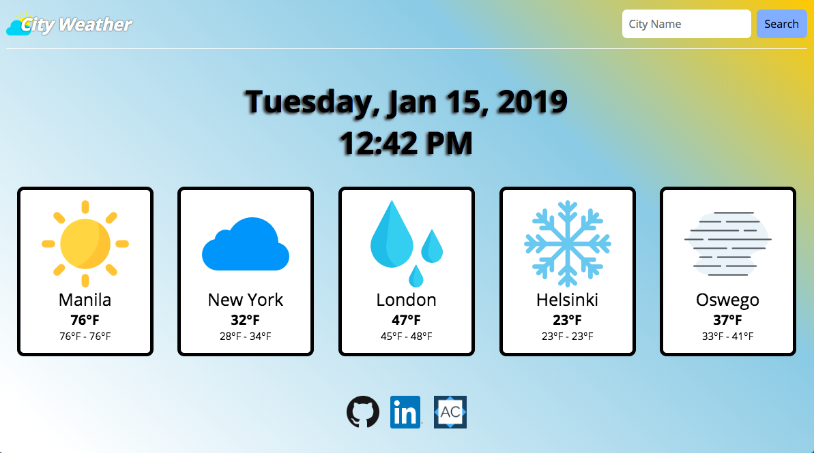
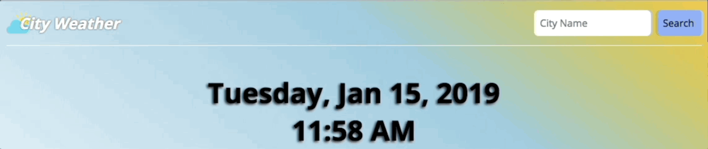

# City Weather

City Weather is a web application that allows users to get current weather for cities around the world. It is built with Ruby on Rails as the backend, PostgreSQL as the database system, and React as the frontend.

Weather information is retrieved from [openweathermap.org](openweathermap.org "Open Weather Map")

[Live Site](https://city-weather-5.herokuapp.com/#/)



## Features

* Responsive CSS that scales well to different viewports
* Search functionality for looking up cities by name
* Saving of cities in the dashboard into local storage
* Adding and removing of cities from dashboard via show page
* CSS Sun 'moves' across the background with 'shadows' cast on the words

### CSS Sun


* Uses CSS variables:
  * Angle of 'sun', defined as `--gradDeg`
  
  ```css
  background-image: linear-gradient(var(--gradDeg), white 5%, rgba(0, 140, 191, 0.46) 70%, #F7C700);
  ```

  * Length of 'shadows' on text, defined as `--shadow`

  ```css
  text-shadow: var(--shadow) 2px 5px rgb(52, 51, 51);
  ``` 

* Function for changing CSS variables:

  ```javascript 
  const cssSun = () => {
    let delta = 2.5;
    let degrees = 0;
    
    const changeBackground = () => {
      if (delta + degrees >= 60) {
        delta = -2.5;
      } else if (delta + degrees <= -60) {
        delta = 2.5;
      }
      degrees += delta;
      document.documentElement
        .style.setProperty("--gradDeg", `${degrees}deg`);
      document.documentElement
        .style.setProperty("--shadow", -degrees/15 + 'px');
    }

    return setInterval(() => changeBackground(), 200);
  };
  ```

## Component Breakdown

* Dashboard - shows saved or preset cities
* City Show - contains additional info of this city
  * Can Add to Dashboard
  * Can Remove from Dashboard
* Search Bar - enables searching for valid cities by name
